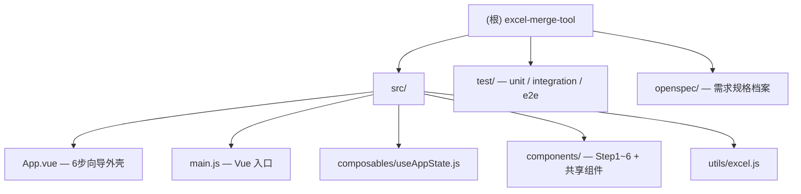

# Excel 合并工具 — CLAUDE.md

> 详细模块文档见各目录下的 CLAUDE.md：[composables](src/composables/CLAUDE.md) · [utils](src/utils/CLAUDE.md) · [test](test/CLAUDE.md)

---

## 项目愿景

纯前端的 Excel/CSV 数据合并工具。用户无需安装任何软件，直接在浏览器中完成两个文件的关联列合并，并以 Excel 或 CSV 格式下载结果。核心价值：零依赖安装、离线可用、支持多工作表与冲突处理。

---

## 架构总览

项目有两条并行交付路径：

| 路径 | 入口 | 构建方式 | 适用场景 |
|------|------|----------|----------|
| **开发模式** | `src/main.js` + `index.html` | Vite dev server | 本地开发、测试 |
| **单文件发布** | `build:single` | `vite-plugin-singlefile` 打包为 `dist-single/index.html` | 离线分发，所有 JS/CSS 内联为单 HTML 文件 |

运行时技术栈：**Vue 3.5** · **Tailwind CSS v4** · **SheetJS xlsx 0.20.3** · **Vite 6**

状态由单个 `useAppState` composable 集中管理，通过 `provide/inject` 注入给所有子组件，不使用 Pinia 或 Vuex。

---

## 目录结构



### 组件清单

| 组件 | 职责 |
|------|------|
| `App.vue` | 6 步向导外壳：步骤指示器、上一步/下一步导航、处理遮罩 |
| `Step1Upload.vue` | 文件上传（xlsx/csv），拖拽或点击，双文件区域 |
| `Step2Sheets.vue` | 工作表选择、预览、起始行配置 |
| `Step3KeyCols.vue` | 关联键列设置，联动/独立模式切换；多 sheet 时计算公共列交集，无公共列自动禁用联动并提示；独立模式下含数据内联预览 |
| `Step4MergeCols.vue` | 合并列选择，全选/全不选/搜索；独立模式下每个 sheet 可折叠，支持按 sheet 独立搜索 |
| `Step5Results.vue` | 合并结果查看：匹配/未匹配/冲突三视图，内联预览 + 全屏 |
| `Step6Export.vue` | 导出摘要、下载 Excel/CSV、重新开始 |
| `CollapsibleExportSettings.vue` | 可折叠导出设置面板；展开时为 `position:absolute` 浮层不影响行高；点击外部（capture 阶段，`setTimeout(0)` 延迟绑定）自动收起 |
| `ExportSettings.vue` | 导出选项表单（4 个复选框 + CSV 禁用提示），被 CollapsibleExportSettings 嵌入 |
| `DataTable.vue` | 分页表格，支持普通模式和全屏（Teleport to body）模式，含搜索/跳页 |
| `InlinePreviewTable.vue` | 轻量行内预览表格，基于视口高度（ResizeObserver + rAF）自动限制显示行数 |
| `AppIcon.vue` | SVG 图标组件，内联 Material Design SVG 路径 |

---

## 运行命令

```bash
npm run dev          # 本地开发，http://localhost:5173
npm run build        # 生产构建 → dist/
npm run build:single # 单文件构建 → dist-single/index.html
npm run fixtures     # 生成测试 fixture 文件
npm run test:all     # 运行全部测试（unit + integration + e2e）
```

---

## 编码规范

- **XSS 防护**：Vue 模板自动转义 HTML 内容；属性值通过 Vue 绑定（`:attr="val"`）传入，不拼接字符串
- **动态键值不作 DOM ID**：冲突组通过数字索引 `ci` 操作，不用原始键字符串
- **键比较**：`String(value).trim()`；键为空/缺失的行归入 unmatchedA/B
- **内部追踪字段**：`__sheet__` 在写入 Excel/CSV 前通过解构剔除（`const { __sheet__, ...rest } = row`）
- **列名冲突前缀**：`A_` / `B_`，由 `resolveColumnNames()` 统一处理
- **全空行过滤**：`parseSheetWithOffset` 在解析阶段过滤所有字段均为空白的行
- **CSV 下载**：包含 UTF-8 BOM（`\uFEFF`）以兼容 Excel 打开中文内容
- **Sheet 名合法性**：`sanitizeSheetName()` 去除 `/ \ ? * [ ] :` 并截断至 31 字符

---

## AI 使用指引

- 修改 `src/utils/excel.js` 中的纯函数后，**必须同步更新** `test/core.test.js` 和 `test/integration.test.js`
- 修改状态字段或 composable 导出接口时，**必须检查** 所有 `inject('appState')` 调用点（Step1~6 + CollapsibleExportSettings 共 7 处）
- Step3 联动模式的前提：`canLink(which)` 对 A/B 两侧均为真（即各侧多 sheet 存在公共列交集）；无公共列时 checkbox 自动禁用，切换为独立模式
- `outputOptions.keepSheetOutput`、`extraSheetUnmatchedA/B`、`extraSheetConflicts` 这 4 个选项控制 CSV 可用性，逻辑在 `Step6Export.vue` 的 `csvDisabled` computed 中，修改时注意联动
- `state.ui.activeSteps` 数组控制步骤激活，通过 `enableStep(n)` / `disableStep(n)` 操作，不要直接赋值
- `CollapsibleExportSettings` 展开状态使用 `position:absolute z-20` 浮层；不可改为 in-flow，否则会撑高父行导致下方数据区被压缩
- `openspec/` 目录仅为规格档案，不包含运行时代码，不需要在构建中处理

---

*更新于 2026-04-06，覆盖率 100%*
