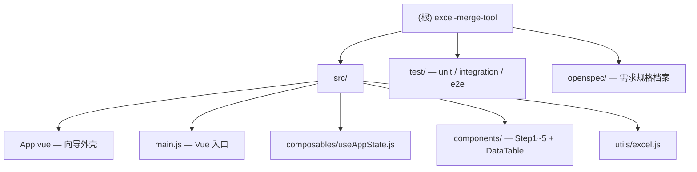

# Excel 合并工具 — CLAUDE.md

> 详细模块文档见各目录下的 CLAUDE.md：[composables](src/composables/CLAUDE.md) · [utils](src/utils/CLAUDE.md) · [test](test/CLAUDE.md)

---

## 项目愿景

纯前端的 Excel/CSV 数据合并工具。用户无需安装任何软件，直接在浏览器中完成两个文件的关联列合并，并以 Excel 或 CSV 格式下载结果。核心价值：零依赖安装、离线可用、支持多工作表与冲突处理。

---

## 架构总览

项目有两条并行交付路径：

| 路径 | 入口 | 构建方式 | 适用场景 |
|------|------|----------|----------|
| **开发模式** | `src/main.js` + `index.html` | Vite dev server | 本地开发、测试 |
| **单文件发布** | `build:single` | `vite-plugin-singlefile` 打包为 `dist-single/index.html` | 离线分发，所有 JS/CSS 内联为单 HTML 文件 |

运行时技术栈：**Vue 3.5** · **Tailwind CSS v4** · **SheetJS xlsx 0.20.3** · **Vite 6**

状态由单个 `useAppState` composable 集中管理，通过 `provide/inject` 注入给所有子组件，不使用 Pinia 或 Vuex。

---

## 目录结构



---

## 运行命令

```bash
npm run dev          # 本地开发，http://localhost:5173
npm run build        # 生产构建 → dist/
npm run build:single # 单文件构建 → dist-single/index.html
npm run fixtures     # 生成测试 fixture 文件
npm run test:all     # 运行全部测试（unit + integration + e2e）
```

---

## 编码规范

- **XSS 防护**：Vue 模板自动转义 HTML 内容；属性值通过 Vue 绑定（`:attr="val"`）传入，不拼接字符串
- **动态键值不作 DOM ID**：冲突组通过数字索引 `ci` 操作，不用原始键字符串
- **键比较**：`String(value).trim()`；键为空/缺失的行归入 unmatchedA/B
- **内部追踪字段**：`__sheet__` 在写入 Excel/CSV 前通过解构剔除（`const { __sheet__, ...rest } = row`）
- **列名冲突前缀**：`A_` / `B_`，由 `resolveColumnNames()` 统一处理
- **全空行过滤**：`parseSheetWithOffset` 在解析阶段过滤所有字段均为空白的行
- **CSV 下载**：包含 UTF-8 BOM（`\uFEFF`）以兼容 Excel 打开中文内容
- **Sheet 名合法性**：`sanitizeSheetName()` 去除 `/ \ ? * [ ] :` 并截断至 31 字符

---

## AI 使用指引

- 修改 `src/utils/excel.js` 中的纯函数后，**必须同步更新** `test/core.test.js` 和 `test/integration.test.js`
- 修改状态字段或 composable 导出接口时，**必须检查** 所有 `inject('appState')` 调用点（5 个 Step 组件均使用）
- `outputOptions.keepSheetOutput`、`extraSheetUnmatchedA/B`、`extraSheetConflicts` 这 4 个选项控制 CSV 可用性，逻辑在 `Step5Results.vue` 的 `csvDisabled` computed 中，修改时注意联动
- `state.ui.activeSteps` 数组控制步骤激活，通过 `enableStep(n)` / `disableStep(n)` 操作，不要直接赋值
- `openspec/` 目录仅为规格档案，不包含运行时代码，不需要在构建中处理

---

*自动生成于 2026-04-04，覆盖率 100%*
